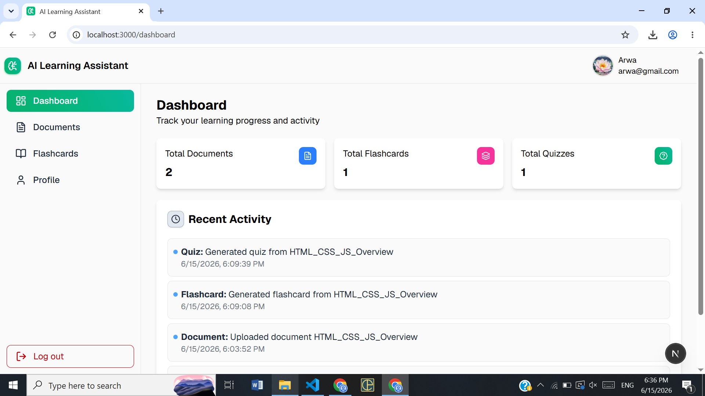
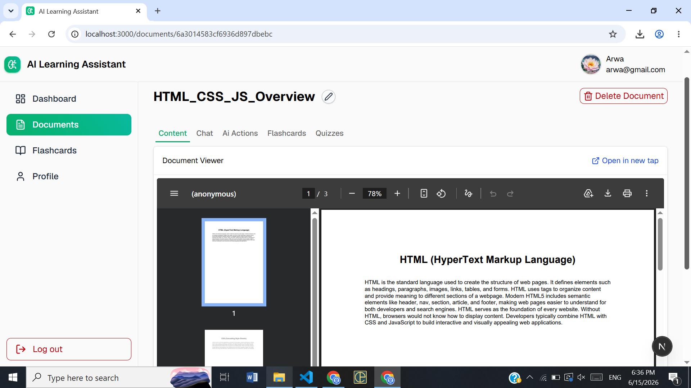
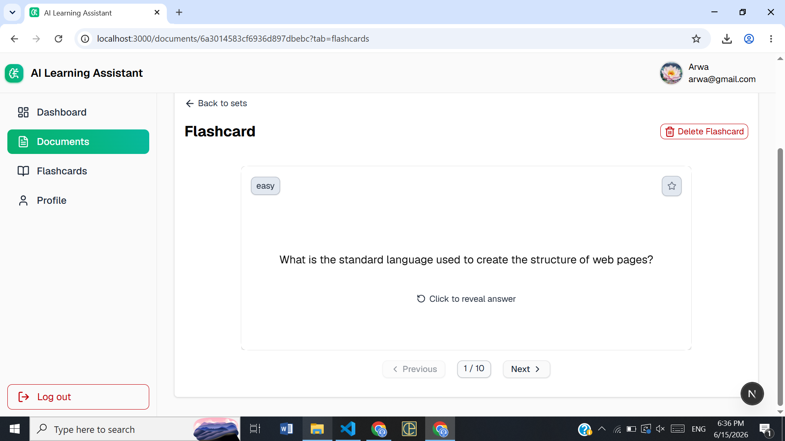
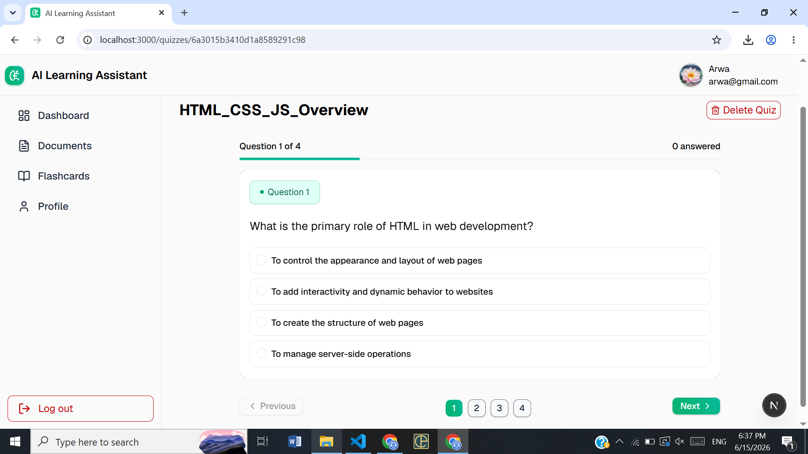
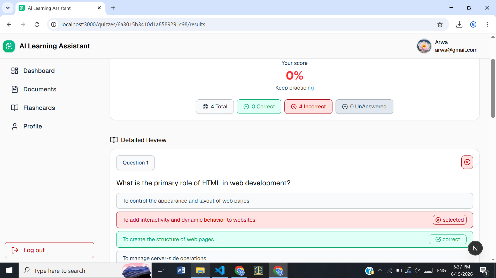

# Ai learning assistant

A full-stack AI-powered learning application that allows users to upload documents, explore their content, and interact with them using AI. Users can chat with their documents, generate summaries, flashcards, quizzes, and get concept explanations in a smart and interactive way.

This project was built for learning purposes and practicing modern full-stack development and AI integration.

Note: The UI design is based on a YouTube tutorial [**Build a Full-Stack AI-Powered Learning Assistant App**](https://youtu.be/iaAdWmAu0TE?si=6K5bPzhlFyn12CTG), with custom improvements and additional features implemented for learning and development purposes.

---

## 🌐 Live Demo

👉 https://full-stack-ai-learning-assistant.vercel.app/

---

## ✨ Features

* Upload and manage documents
* View uploaded documents and their content
* AI-powered document chat (ask questions about your files)
* Generate smart summaries of documents
* Create flashcards from document content
* Generate quizzes for self-assessment
* Explain specific concepts from documents using AI
* User authentication (Register & Login)
* JWT-based authorization
* User-specific document management
* Responsive and modern UI

---

## App Preview

* Home Page



## Document Page



* Flashcard



* Quiz



* Quiz Result




---

## 🛠️ Tech Stack

### Frontend

* Next.js 
* React
* TypeScript
* Tailwind CSS
* Shadcn UI
* Flowbite

### Backend

* Node.js
* Express.js
* MongoDB
* Mongoose
* JSON Web Token (JWT)

---


## 🚀 Getting Started (Run Locally)

### 1. Clone the repository

```bash
git clone https://github.com/20Arwa/fullStack-ai-learning-assistant.git
cd fullStack-ai-learning-assistant
```

### 2. Install dependencies

```bash
npm install
```

### 3. Create Environment Variables

Create the following environment files:

### 🔹 Server (`/server/.env`)

```env
MONGODB_URL=your_mongodb_connection_string
PORT=5000
SERVER_URL=http://localhost:5000
CLIENT_URL=http://localhost:3000
ACCESS_TOKEN_SECRET=your_access_token_secret
GEMINI_API_KEY=your_gemini_api_key
```

### 🔹 Client (`/client/.env.local`)

```env
NEXT_PUBLIC_SERVER_BASE_URL=http://localhost:5000
```

### 4. Run the development server

```bash
npm run dev
```

### 5. Open in browser

http://localhost:3000


